# Task Manager — Flutter Mobile App

A Flutter Task Manager app built for the Electro Pi Flutter Mobile Developer technical assessment. The app integrates with a small custom REST API (Node.js/Express) for authentication, projects, and tasks.

## Project Description

Users can register/login, browse a list of projects fetched from the API, drill into a project to see and manage its tasks (mark as done, add new tasks), and view/edit their profile (logout).

## Screenshots

### Light mode

| Splash | Login | Register | Projects |
|---|---|---|---|
| 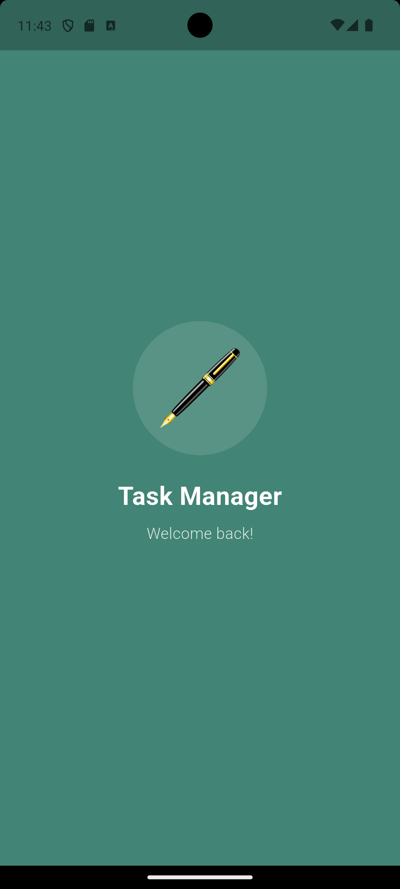 | 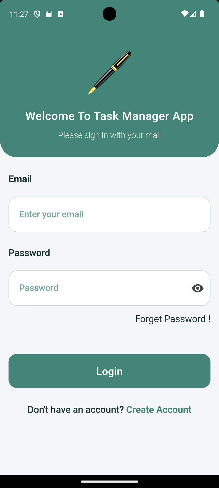 | 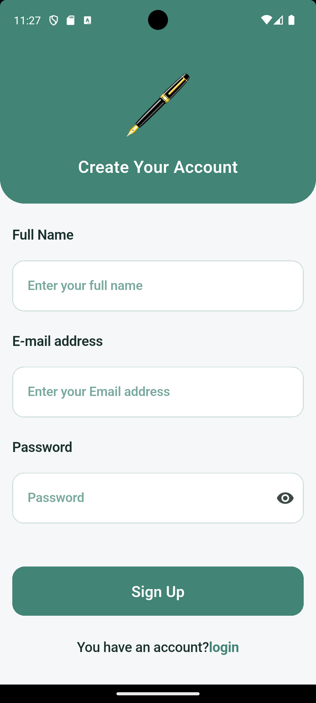 | 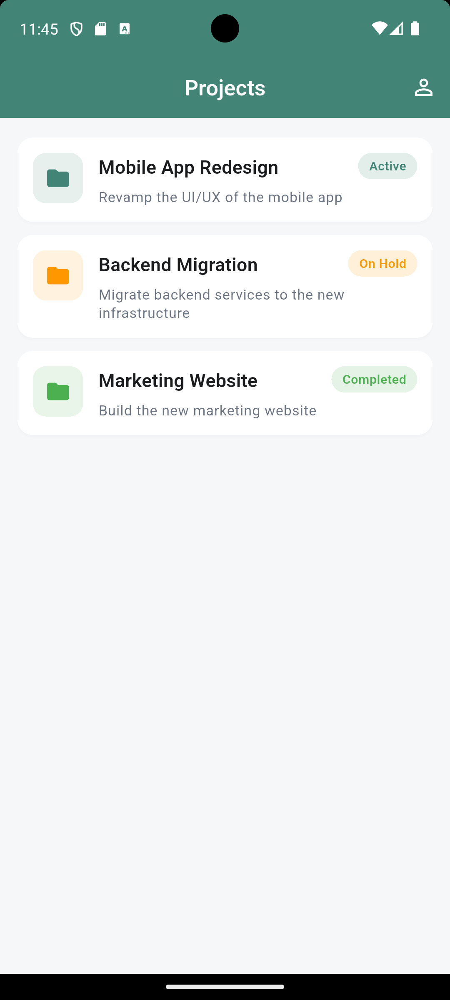 |

| Project Details | Add Task | Profile |
|---|---|---|
| 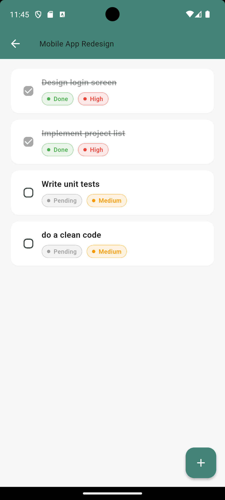 | 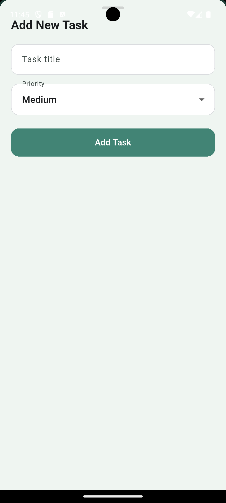 | 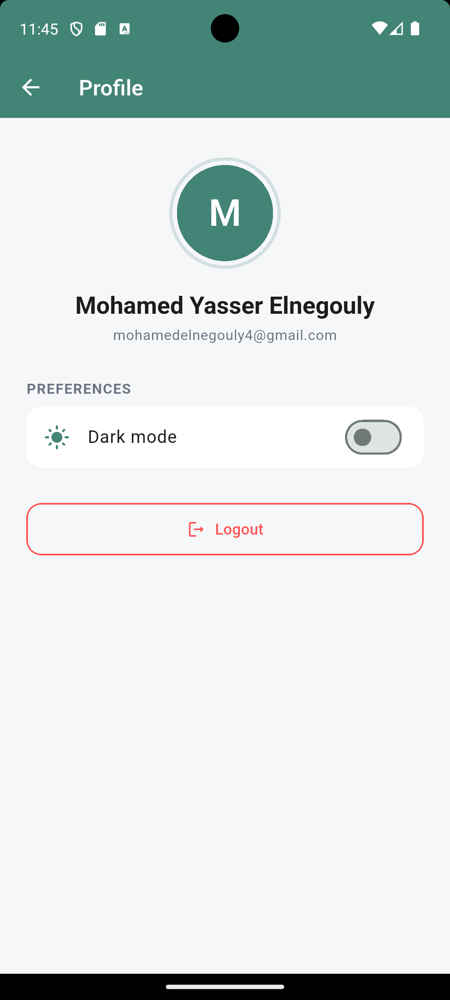 |

### Dark mode

| Login | Register | Projects |
|---|---|---|
| 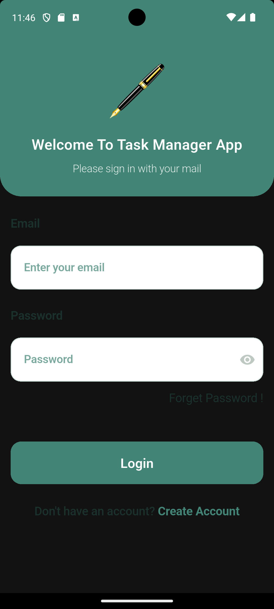 | 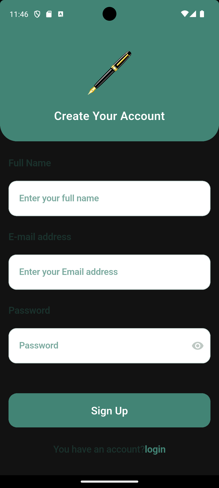 | 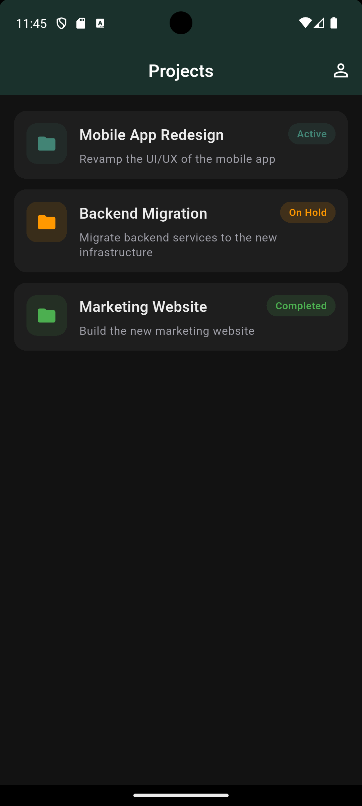 |

| Project Details | Add Task | Profile |
|---|---|---|
| 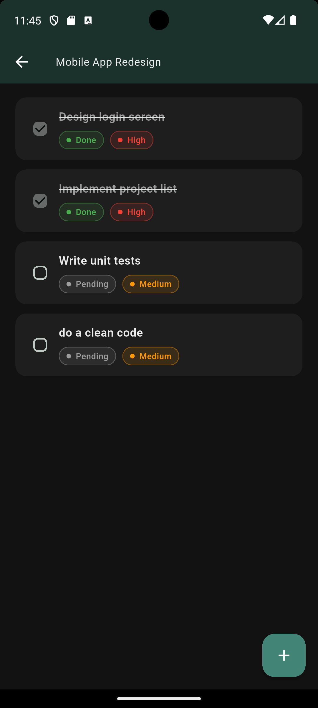 | 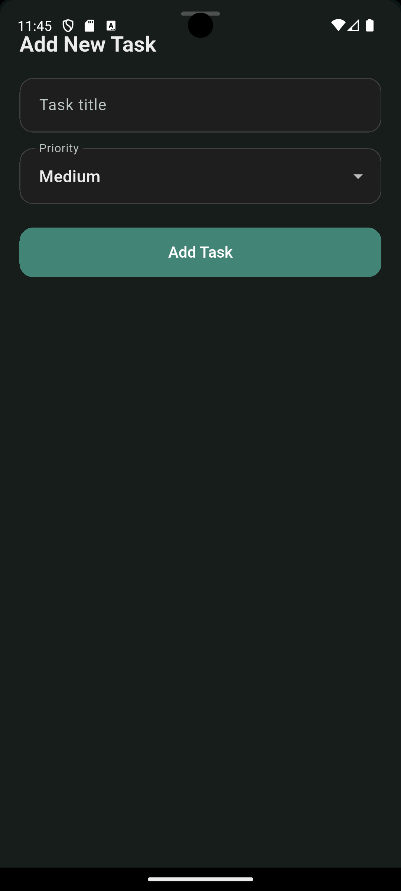 | 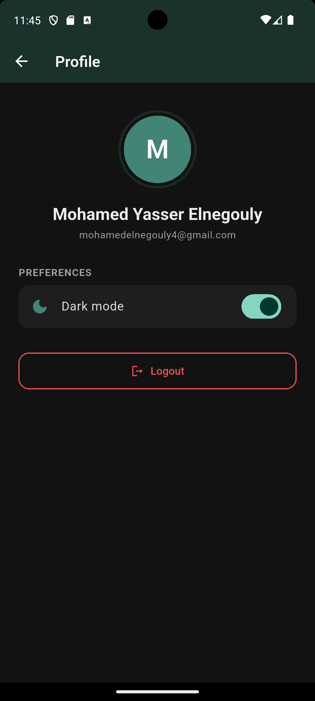 |

## Tech Stack

| Category | Technology |
|---|---|
| Framework | Flutter (stable) |
| Language | Dart |
| State Management | BLoC / Cubit (`flutter_bloc`) |
| HTTP Client | Dio |
| Local Storage | Hive (user data) + Hive box (JWT token) |
| Dependency Injection | get_it |
| Navigation | go_router |
| Architecture | Clean Architecture (data / presentation layers per feature) |
| Backend | Node.js + Express + MongoDB (Atlas), deployed serverless on Vercel |

## Architecture

```
lib/
  core/
    errors/          -> Failure / ServerError mapping for Dio exceptions
    routers/          -> GoRouter configuration + auth redirect guard
    utils/             -> ApiService (Dio wrapper), service locator (get_it), constants, colors
  features/
    Authentication/
      data/            -> AuthModel, AuthRepo (interface) + AuthRepoImpl
      presentation/    -> AuthCubit/AuthState, Login & Register screens + widgets
    Projects/
      data/            -> ProjectModel, TaskModel, ProjectsRepo (interface) + ProjectsRepoImpl
      presentation/    -> ProjectsCubit (project list), TasksCubit (tasks of a project),
                          ProjectsScreen, ProjectDetailsScreen, reusable widgets
    Profile/
      presentation/    -> ProfileScreen (user info + logout)
```

Each feature keeps UI, state management (Cubit), and data (repo + API calls) in separate layers. `ApiService` centralizes all Dio calls; repositories return `Either<Failure, T>` (via `dartz`) so cubits can handle success/error uniformly.

## Features

- **Authentication**: Login (email/password), Register (name/email/password), JWT stored in a Hive box, auto-redirect to Home if already logged in (`GoRouter.redirect`).
- **Home / Projects**: list of projects from the API (title, description, status), pull-to-refresh, loading indicator, error view with retry, empty-state widget.
- **Project Details**: tasks for the selected project (title, status, priority), checkbox to mark a task as Done, add a new task via a bottom sheet (title + priority).
- **Profile**: shows the logged-in user's name/email, Logout button (clears token, navigates to Login).
- **Responsive layout**: a shared `ResponsiveCenter` widget (`lib/core/widgets/responsive_center.dart`) caps and centers content width on large screens/tablets while staying full-width on phones; applied to every screen and the Add Task sheet. Verified with a widget test (`test/widgets/responsive_center_test.dart`) at both a phone (360px) and tablet (1200px) width.

## Bonus Features Implemented

- **Dark mode**: toggle in Profile, persisted in Hive (`settingsBox`), applied via a `ThemeCubit` driving `MaterialApp.router`'s `themeMode`.
- **Offline support**: `ProjectsRepoImpl` caches the last successful `/projects` and `/projects/:id/tasks` responses in Hive (`cacheBox`); if a request fails (e.g. no network), it transparently falls back to the cached data instead of erroring out.
- **Animations**: Hero transition on the project title between the Projects list and Project Details screen, plus a custom slide + fade page transition (via `go_router`'s `CustomTransitionPage`) for the Project Details and Profile routes.
- **Tests**: unit tests for `ProjectModel`/`TaskModel` parsing and `Failure` mapping, widget tests for `EmptyStateView` and `ProjectCard` (see `/test`). Run with `flutter test`.

## Getting Started

### 1. Run the app (uses the live backend — no setup needed)

`lib/core/utils/apitoken.dart` already points at the deployed backend:

```
https://task-manager-backend-ngoly.vercel.app/api/
```

So you can just:

```bash
flutter pub get
flutter run
```

and log in / register straight away — no server to start.

### 2. (Optional) Run the backend locally instead

The backend lives in `/backend` here for reference, and is also published as its own repo for deployment: [task-manager-backend](https://github.com/MohamedElnegouly/task-manager-backend).

```bash
cd backend
npm install
cp .env.example .env   # then fill in MONGODB_URI with your own MongoDB Atlas connection string
npm start
```

It exposes:

- `POST /api/auth/signup` — `{ name, email, password }`
- `POST /api/auth/signin` — `{ email, password }`
- `GET /api/projects` — requires `Authorization: Bearer <token>`
- `GET /api/projects/:projectId/tasks`
- `POST /api/projects/:projectId/tasks` — `{ title, priority }`
- `PATCH /api/tasks/:taskId` — `{ status }`

Data is persisted in MongoDB and auto-seeded with 3 sample projects and 5 sample tasks the first time the `projects` collection is empty.

If you point the app at a local instance instead of the deployed one, update `lib/core/utils/apitoken.dart`'s `baseUrl`:

- Android emulator: `http://10.0.2.2:3000/api/`
- iOS simulator: `http://localhost:3000/api/`
- Physical device: `http://<your-machine-LAN-IP>:3000/api/`

## Dependencies

See `pubspec.yaml`. Key packages: `flutter_bloc`, `bloc`, `dio`, `dartz`, `get_it`, `go_router`, `hive` / `hive_flutter`, `flutter_secure_storage`, `cached_network_image`, `equatable`.

## Notes on Implementation

- A real REST API (Node/Express) was built instead of using `jsonplaceholder` because the spec's data shape (projects with status, tasks with status + priority) doesn't map cleanly onto jsonplaceholder's resources — a purpose-built API keeps the contract exact and lets task status updates (`PATCH`) actually persist correctly.
- The backend is deployed as a serverless function on **Vercel** (no card required for the Hobby tier) and persists data in **MongoDB Atlas** (free M0 cluster) rather than in-memory arrays — in-memory state doesn't survive across serverless invocations, since each request can hit a different warm/cold function instance. `backend/db.js` caches the Mongo connection and a one-time seed check across warm invocations to avoid reconnecting/reseeding on every request.
- The backend also lives in its own standalone repo ([task-manager-backend](https://github.com/MohamedElnegouly/task-manager-backend)) so Vercel can deploy it directly without needing the rest of this Flutter repo.
- JWT is stored in a Hive box (`authBox`) and read by `GoRouter`'s `redirect` to decide the initial route and guard auth-only pages.
- Error handling: all repository calls catch `DioException` and map it to a `Failure` with a user-facing message (`lib/core/errors/failure.dart`), surfaced via Cubit states and shown as retryable error views / snackbars.
